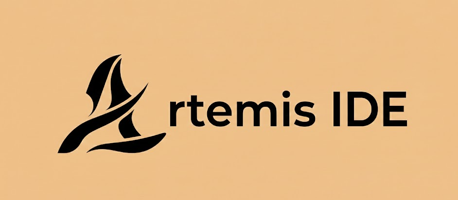
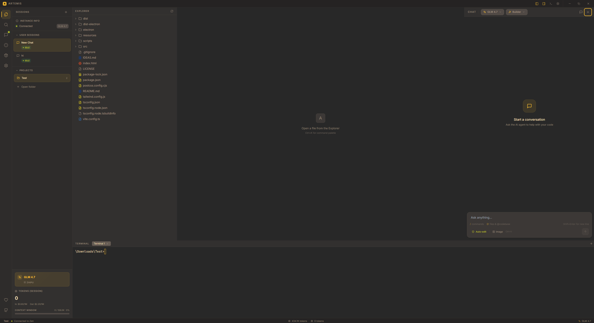
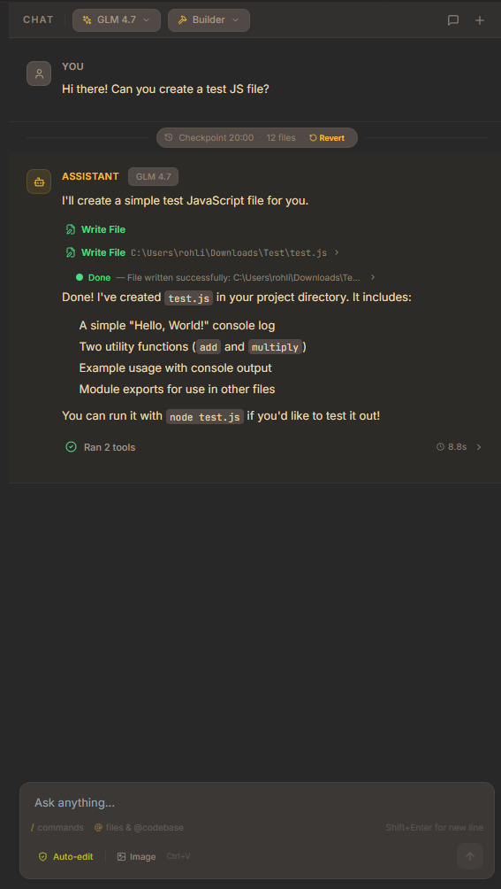
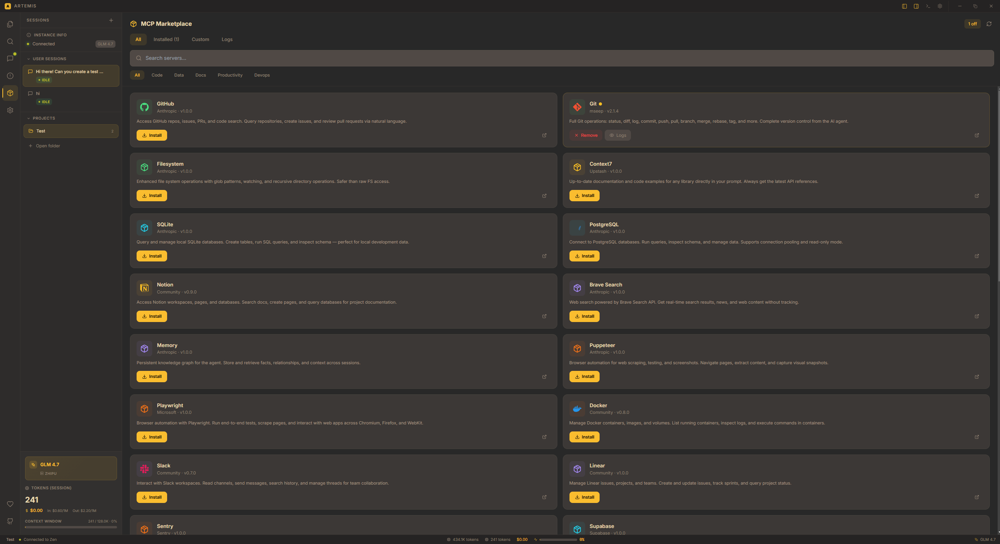
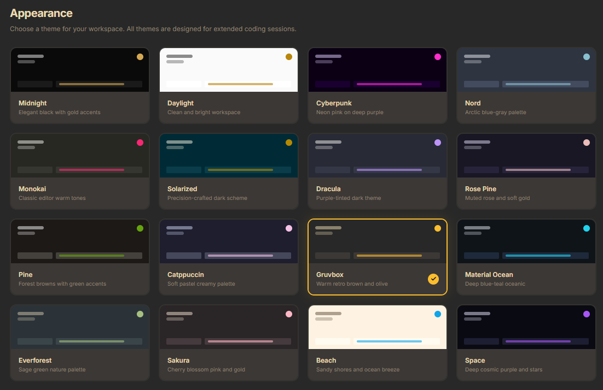

<div align="center">



<br />

# Artemis IDE

### ⚡ The AI-Powered Development Environment Built for Speed

[](LICENSE)
[](https://electronjs.org/)
[](https://reactjs.org/)
[](https://typescriptlang.org/)

**Artemis is a free, open-source AI IDE that brings autonomous agent capabilities directly into your editor.**
No subscriptions. No cloud lock-in. Just pure developer power.

[🚀 Getting Started](#-getting-started) · [✨ Features](#-features) · [📸 Screenshots](#-screenshots) · [🤝 Support](#-support--community)

</div>

---

## ✨ Features

### 🤖 AI Agent System
- **Autonomous Builder Mode** — Let the agent plan, code, and execute multi-step tasks end-to-end
- **Planner Mode** — Get structured plans before any code is written
- **Chat Mode** — Quick conversational help without tool execution
- **Multi-Provider Support** — Works with OpenCode Zen, Z.AI, OpenAI, Anthropic, and more

### 🛠️ Full IDE Experience
- **Monaco Editor** — The same editor engine that powers VS Code, with syntax highlighting for 40+ languages
- **Integrated Terminal** — Real PTY terminal with full shell access (cmd, PowerShell, bash)
- **File Explorer** — Browse, create, rename, and delete files and folders
- **Multi-Tab Editing** — Pin tabs, reorder them, and work across multiple files
- **Project Search** — Regex-powered search across your entire codebase

### 🔌 MCP Marketplace
- **One-Click Install** — Browse and install Model Context Protocol servers instantly
- **Custom Servers** — Add your own MCP servers with full configuration
- **Live Tool Status** — See connected tools and server health in real-time

### 🎨 16 Beautiful Themes
Dark · Light · Cyberpunk · Nord · Monokai · Solarized · Dracula · Rosé Pine · Pine · Catppuccin · Gruvbox · Material Ocean · Everforest · Sakura · Beach · Space

### 🔒 Security First
- **Encrypted API Keys** — Stored with OS-level `safeStorage` encryption
- **Path Validation** — Blocks access to system directories
- **Shell Injection Prevention** — Commands are parsed and spawned without a shell
- **URL Allowlist** — API proxy only connects to approved domains
- **Tool Approval System** — Review and approve agent actions before execution

### 🎵 Extra Features
- **Sound Effects & Notifications** — Know when tasks complete even while tabbed out
- **Discord Rich Presence** — Show what you're working on
- **Token Tracking** — Real-time cost estimation and context window visualization
- **Checkpoints** — Snapshot and restore your project state at any point
- **Auto-Linting** — Built-in linter integration for cleaner code
- **Web Search** — DuckDuckGo-powered search available to the AI agent
- **Command Palette** — Quick access to every action with `Ctrl+Shift+P`

---

## 📸 Screenshots

### Main Editor View


### AI Chat in Action


### MCP Marketplace


### Theme Gallery


---

## 🚀 Getting Started

### Prerequisites
- **Node.js** 18+ and **npm**
- **Git**

### Installation

```bash
# Clone the repository
git clone https://github.com/Foxemsx/Artemis.git
cd Artemis

# Install dependencies
npm install

# Start in development mode
npm run dev
```

### Building

```bash
npm run build
```

---

## 🏗️ Tech Stack

| Layer | Technology |
|-------|-----------|
| **Framework** | Electron 35 |
| **Frontend** | React 18 + TypeScript 5.3 |
| **Styling** | Tailwind CSS 3.4 |
| **Editor** | Monaco Editor |
| **Terminal** | xterm.js + node-pty |
| **Animations** | Framer Motion |
| **Bundler** | Vite 5 |

---

## 🤝 Support & Community

<div align="center">

If Artemis helps your workflow, consider supporting the project! 💛

[](https://buymeacoffee.com/foxemsx)
[](https://github.com/Foxemsx/Artemis)

</div>

### 💬 Get in Touch

- **Discord** — Add me: <kbd>767347091873595433</kbd>
- **GitHub Issues** — [Report bugs or request features](https://github.com/Foxemsx/Artemis/issues)
- **Stars** ⭐ — If you like Artemis, give it a star on GitHub!

---

## 📄 License

Artemis IDE is licensed under the **MIT License** — see the [LICENSE](LICENSE) file for details.

You are free to use, modify, and distribute this software. Attribution is required.

---

<div align="center">

**Built with 🔥 by [Foxemsx](https://github.com/Foxemsx)**


</div>
